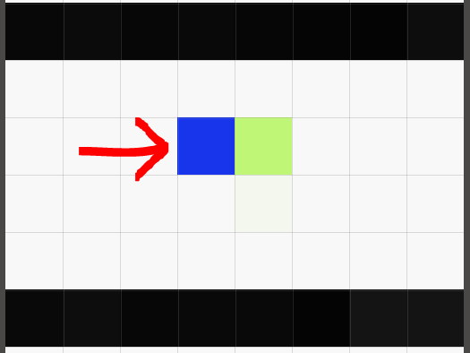
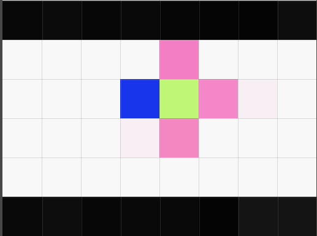
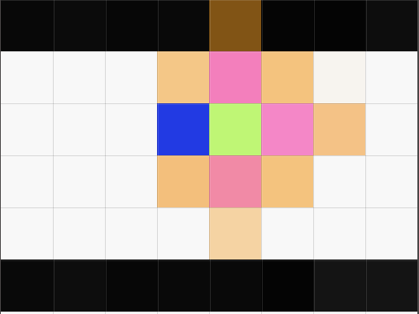
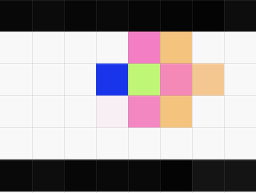

# Deadlock and Optimizations

## Freeze Deadlock

### Location and helper functions

All of helper function and implementation can be found in **util.c** between 
lines 235 and 415. 

#### Main function **freeze_deadlock**
****freeze_deadlock****: this function is similar in structure to provided simple_corner_deadlock
function. Only difference is that, this function uses helper functions 
mentioned below rather than corner_check to check for deadlock.
#### Helper functions
* is_a_box_goal : return 1 if there is a box or filled goal at this location,
  (non-wall obstruction)
* is_a_box_wall_goal : returns 1 if there is a box, wall, or filled goal at 
  this location
* deadlock_right : to find freeze deadlock if we are moving right
* deadlock_left  : to find freeze deadlock if we are moving left
* deadlock_up    : to find freeze deadlock if we are moving up
* deadlock_down  : to find freeze deadlock if we are moving down

### Explaination 
(this is not a perfect way to do it, but it works for most cases)

Lets say we are pushing this blue box to right 

Then we need to see if there is some obstruction at the pink places

If there is a 'non-wall' obstruction at those pink places we then check if 
those are also obstructed in a similar way

This way we end up checking all of light-brown places. 

For this example lets say we found an obstruction at the pink place right to 
green, we then check these three light-brown places. If any of these brown 
places have a non-brown obstruction we declare it as deadlocked.

This algorithm could be improved if we recursively find obstruction points 
until we hit a wall or empty spot. Currently, for the simplicity sake the 
algorithm only runs two level deep. This is enough to clear given test cases. 

# Other modifications (memory management)
* free_map function was created in ai.c between lines 145 to 153 to make it 
easier to free a map array. 

* free_memory function was modified to free the map array at 
expanded_nodes_table[ i ]->state.map. This modification is done between 
  lines 157 and 159. 
* new_node->state.map was freed everytime whenever new_node was freed (line 
  255, 266)
* line 279 - 286 were added to free init_data, pq
